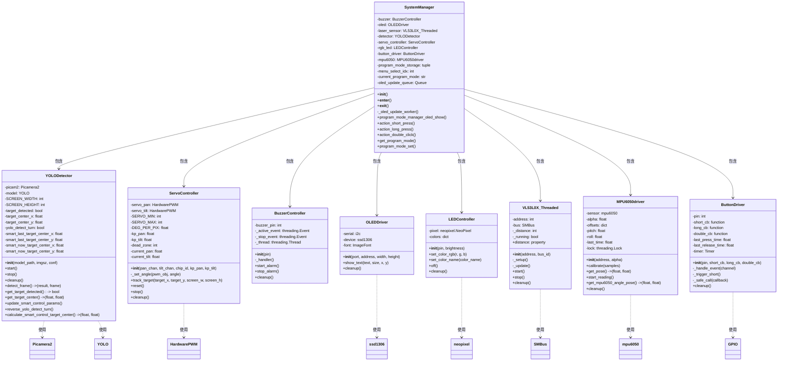
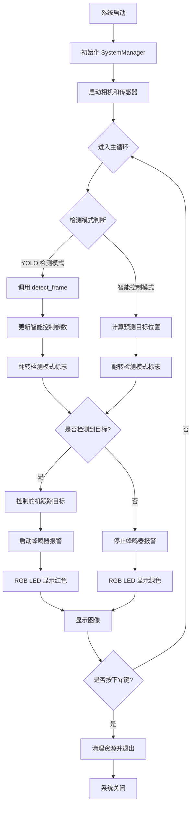
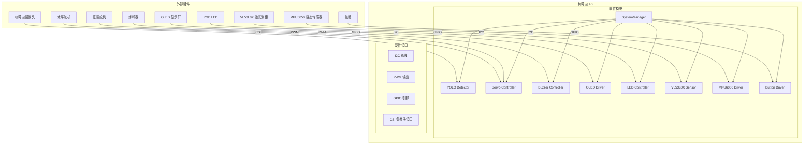
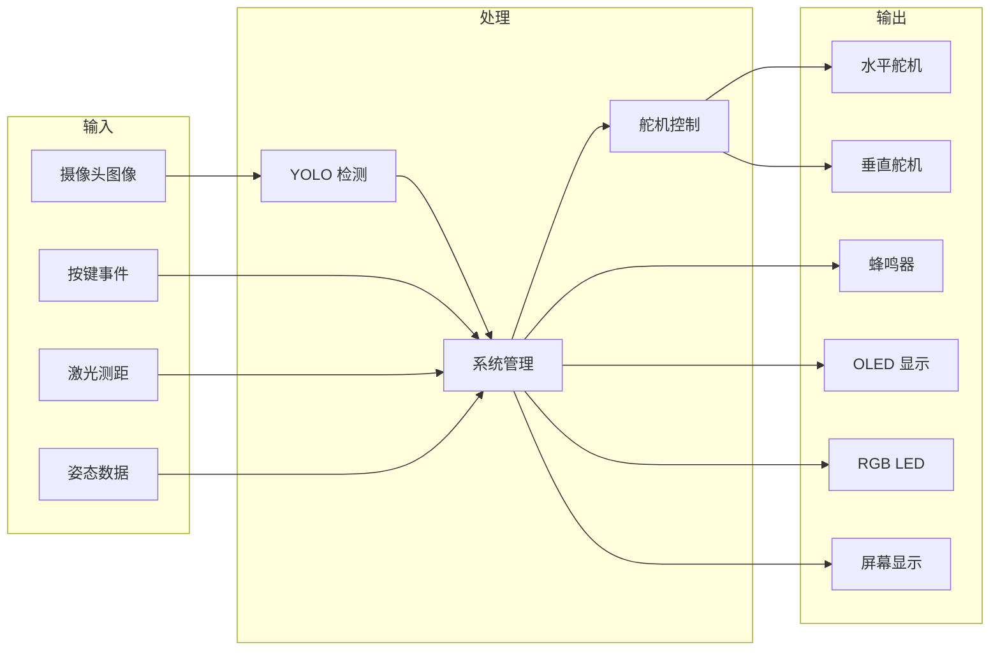
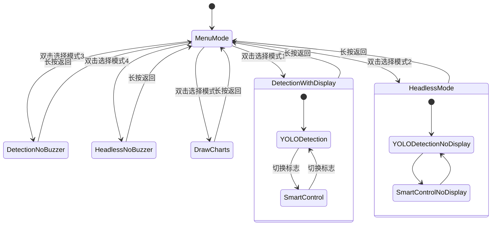
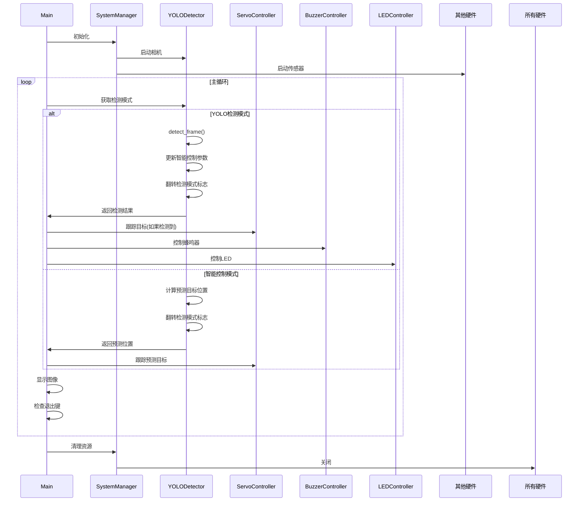

# YOLO 检测与跟踪系统架构图

## 1. 类图 (Class Diagram)

## 2. 系统流程图 (System Flowchart)

## 3. 硬件组件图 (Hardware Component Diagram)

## 4. 数据流图 (Data Flow Diagram)

## 5. 状态图 (State Diagram - 程序模式)

## 6. 时序图 (Sequence Diagram - 主循环)

## 总结

该系统是一个完整的嵌入式计算机视觉项目，具有以下特点：

1. **模块化设计**：每个硬件驱动独立封装，便于维护和测试。
2. **智能控制**：交替使用 YOLO 检测和预测控制，平衡精度和性能。
3. **多模式支持**：通过按键切换不同工作模式，适应不同场景。
4. **资源管理**：使用上下文管理器和清理函数确保资源正确释放。
5. **实时反馈**：通过蜂鸣器、LED 和 OLED 提供多感官反馈。

该架构适用于需要实时目标检测和跟踪的嵌入式应用，如无人机跟踪、安防监控、机器人视觉等。